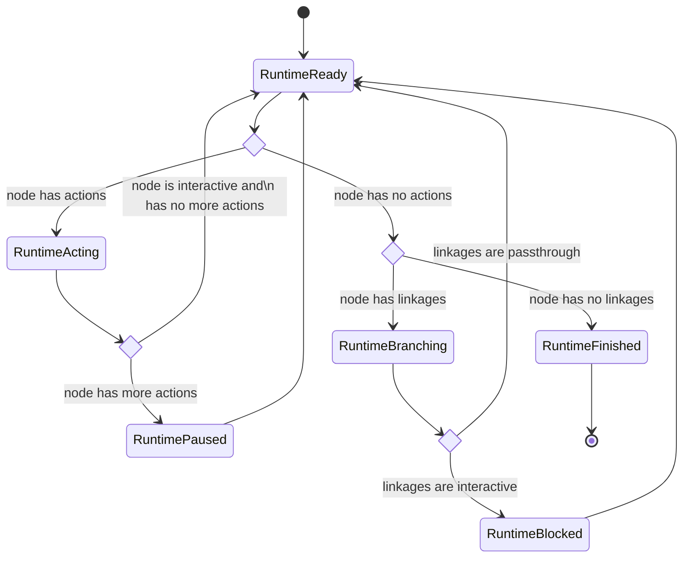

```mermaid
stateDiagram-v2
    state "RuntimeReady" as ready
    state "RuntimeActing" as acting
    state "RuntimePaused" as paused
    state "RuntimeBlocked" as blocked
    state "RuntimeBranching" as branching
    state "RuntimeFinished" as finished
    [*] --> ready
    state has_actions <<choice>>
    ready --> has_actions
    has_actions --> acting: node has actions
    state is_interactive <<choice>>
    acting --> is_interactive
    is_interactive --> ready: node is interactive and\n has no more actions
    is_interactive --> paused: node has more actions
    paused --> ready
    state has_linkages <<choice>>
    has_actions --> has_linkages: node has no actions
    has_linkages --> branching: node has linkages
    has_linkages --> finished: node has no linkages
    state has_interactive_linkages <<choice>>
    branching --> has_interactive_linkages
    has_interactive_linkages --> blocked: linkages are interactive
    has_interactive_linkages --> ready: linkages are passthrough
    blocked --> ready
    finished --> [*]
```