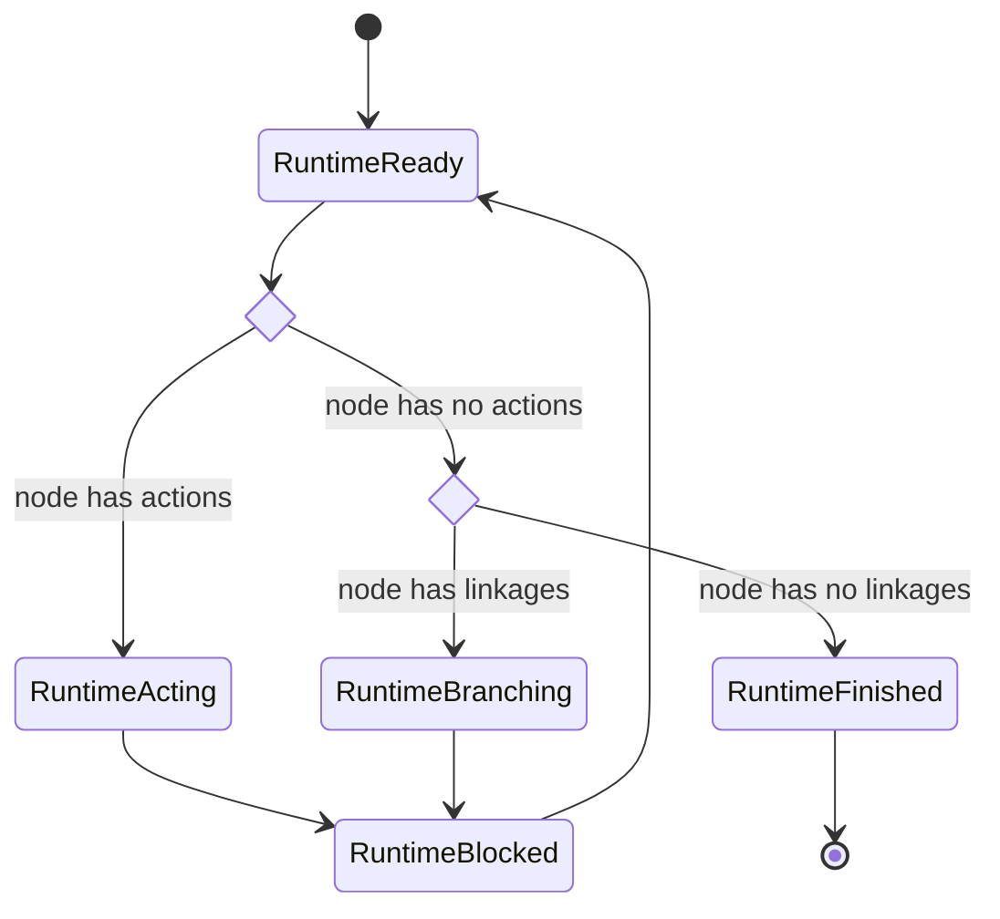

```mermaid
stateDiagram-v2
    state "RuntimeReady" as ready
    state "RuntimeActing" as acting
    state "RuntimeBlocked" as blocked
    state "RuntimeBranching" as branching
    state "RuntimeFinished" as finished
    
    [*] --> ready
    
    state has_actions <<choice>>

    ready --> has_actions

    has_actions --> acting: node has actions
    acting --> blocked
    blocked --> ready
    
    state has_linkages <<choice>>
    
    has_actions --> has_linkages: node has no actions
    has_linkages --> branching: node has linkages
    has_linkages --> finished: node has no linkages

    
    branching --> blocked
    
    finished --> [*]
```